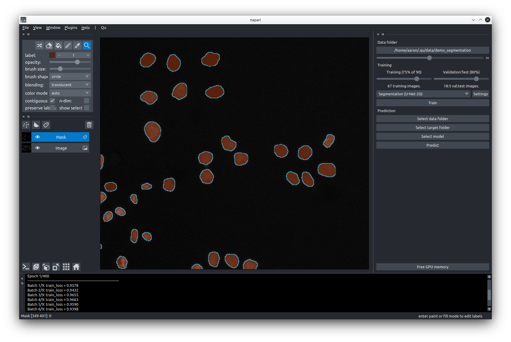

# Qu

Qu is an attempt to make the full deep learning workflow more interactive by providing a user interface (implemented as napari widget) that abstracts all steps from ground truth generation and curation to training and prediction. 



Qu is released under the terms of the Apache License version 2.0 (see LICENSE.txt). All libraries used by Qu have their own licenses.

## Installation

Install dependencies from `environment.yml` or `conda-{platform}.lock`

`platform` is one of `osx-64`, `linux-64`, or `win-64`.

```bash
cd qu
conda env create -f environment.yml
conda activate qu
```

or:

```bash
cd qu
conda create -n qu --file conda-{platform}.lock
conda activate qu
```
