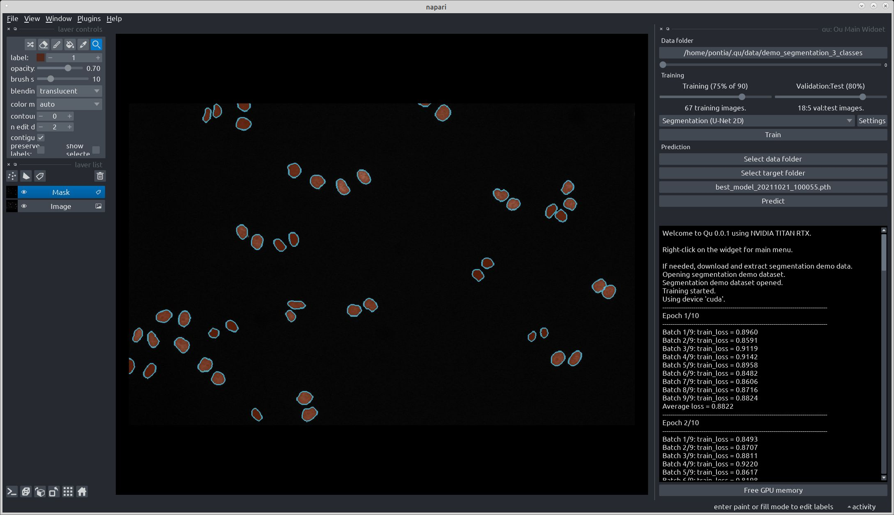

# Qu

Qu is an attempt to make the full deep learning workflow more interactive by providing a user interface that abstracts all steps from ground truth generation and curation to training and prediction. 

Qu is implemented as a [plug-in](https://napari.org/plugins/stable/index.html) for the great [napari](https://napari.org/) multi-dimensional image viewer for python and makes heavy use of the [MONAI framework](https://monai.io).



Qu is released under the terms of the Apache License version 2.0 (see [LICENSE](./LICENSE)). All libraries used by Qu have their own licenses.

## Installation

Install napari as [explained in the official documentation](https://napari.org/tutorials/fundamentals/installation.html). It is recommended to create a dedicated environment:

```
conda create -y -n napari-env python=3.8
conda activate napari-env
pip install "napari[all]"
```

Activate the `napari-env` environment with `conda activate napari-env`, clone Qu and install it as a napari plug in: 

```bash
git clone https://github.com/aarpon/qu
cd qu
pip install -e .
```

## Getting started

Qu can be started from the `Plugins` menu. The Qu main menu can be opened right-clicking on the Qu main widget.

From the `Demos` menu, choose `Segmentation dataset: 2|3 classes` or `Restoration dataset`. 

> **Note**: Qu cannot be installed from the [napari-hub](https://www.napari-hub.org) yet.
## User manual

Detailed instructions [will follow soon](https://github.com/aarpon/qu/wiki/Qu).

